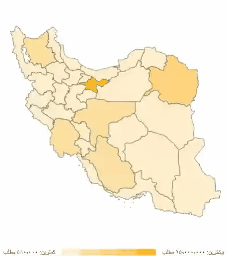

# react-iran-maps

Create powerful and interactive React SVG maps of Iran based on d3-geo, react-simple-maps, and topojson. This package provides ready-to-use map components featuring all Iranian provinces and counties with drill-down capabilities.

[](https://www.npmjs.com/package/react-iran-maps) [](https://www.npmjs.com/package/react-iran-maps) [ ](https://bundlephobia.com/package/react-iran-maps) [](LICENSE) [](https://www.typescriptlang.org/) [](https://github.com/rezasohrabi/react-iran-maps/pulls)



## Features

✨ **Interactive Maps** - Click to drill down from provinces to counties
🗺️ **Complete Coverage** - All 31 provinces and 429+ counties of Iran
📊 **TopoJSON Based** - Lightweight and efficient geo data
🎨 **Dual Legend Modes** - Quantitative (numeric) and Qualitative (categorical) data visualization
🌈 **Customizable Colors** - Full control over color gradients and category colors
🎯 **Smart Tooltips** - Built-in tooltips with custom content rendering
🎬 **Smooth Animations** - Fluid transitions powered by Motion library
🌍 **Persian & English Support** - Bilingual property names
⚡ **TypeScript Support** - Fully typed components and interfaces
📱 **Responsive** - Works on all screen sizes with configurable aspect ratio

## Installation

```bash
npm install react-iran-maps
# or
pnpm add react-iran-maps
# or
yarn add react-iran-maps
```

## Quick Start

```tsx
import { ChoroplethMap } from "react-iran-maps";

function App() {
  return (
    <div style={{ width: "100%", height: "600px" }}>
      <ChoroplethMap />
    </div>
  );
}
```

## Usage Examples

### Basic Map

Display a static map of Iran with all provinces (no drill-down):

```tsx
import { ChoroplethMap } from "react-iran-maps";

export default function BasicMap() {
  return (
    <div style={{ width: "800px", height: "600px" }}>
      <ChoroplethMap />
    </div>
  );
}
```

### Interactive Map with Drill-Down

Enable interactive drill-down to explore province counties:

```tsx
import { ChoroplethMap } from "react-iran-maps";

export default function InteractiveMap() {
  return (
    <div style={{ width: "800px", height: "600px" }}>
      <ChoroplethMap drilldown={true} />
    </div>
  );
}
```

When `drilldown` is enabled:

- **Click on any province** to zoom in and view its counties
- **Smooth animations** transition between province and county views
- **Breadcrumb navigation** appears showing "ایران / ProvinceName"
- **Click "ایران"** in the breadcrumb to return to the main view

### Data Visualization (Choropleth Maps)

The `ChoroplethMap` component supports two types of data visualization:

#### 1. Quantitative (Numeric) Data

Display numeric data with an automatic gradient-based color scale:

```tsx
import { ChoroplethMap, ProvinceData } from "react-iran-maps";

const populationData: ProvinceData[] = [
  {
    name: "تهران",
    value: 15000000,
    counties: [
      { name: "تهران", value: 8500000 },
      { name: "ری", value: 2000000 },
      { name: "ورامین", value: 1200000 },
      { name: "شهریار", value: 800000 },
      { name: "اسلامشهر", value: 600000 },
      { name: "پاکدشت", value: 400000 },
    ],
  },
  {
    name: "اصفهان",
    value: 5120000,
    counties: [
      { name: "اصفهان", value: 2000000 },
      { name: "کاشان", value: 500000 },
      { name: "نجف‌آباد", value: 400000 },
    ],
  },
  // ... more provinces
];

export default function QuantitativeMap() {
  return (
    <div style={{ width: "100%", height: "600px" }}>
      <ChoroplethMap
        drilldown
        data={populationData}
        legend={{
          mode: "quantitative",
          colors: ["#FFEECB", "#FFDFA0", "#FFD47F", "#FFC759", "#FFB728"],
        }}
      />
    </div>
  );
}
```

#### 2. Qualitative (Categorical) Data

Display categorical data with distinct colors for each category:

```tsx
import { ChoroplethMap, ProvinceData } from "react-iran-maps";

const categoryData: ProvinceData[] = [
  {
    name: "تهران",
    value: "بالا",
    counties: [
      { name: "تهران", value: "بالا" },
      { name: "شمیرانات", value: "بالا" },
      { name: "ری", value: "متوسط" },
      { name: "ورامین", value: "متوسط" },
      { name: "شهریار", value: "پایین" },
    ],
  },
  {
    name: "اصفهان",
    value: "متوسط",
    counties: [
      { name: "اصفهان", value: "بالا" },
      { name: "کاشان", value: "متوسط" },
      { name: "نجف‌آباد", value: "پایین" },
    ],
  },
  // ... more provinces
];

export default function QualitativeMap() {
  return (
    <div style={{ width: "100%", height: "600px" }}>
      <ChoroplethMap
        drilldown
        data={categoryData}
        legend={{
          mode: "qualitative",
          items: [
            { value: "پایین", color: "#e8f5e9", label: "پایین" },
            { value: "متوسط", color: "#81c784", label: "متوسط" },
            { value: "بالا", color: "#2e7d32", label: "بالا" },
          ],
        }}
      />
    </div>
  );
}
```

**Data Structure**:

```typescript
interface CountyData {
  name: string; // County name (in Persian)
  value?: string | number; // Value to display (number for quantitative, string for qualitative)
}

interface ProvinceData {
  name: string; // Province name (in Persian)
  value?: string | number; // Value to display
  counties?: CountyData[]; // Optional county-level data
}
```

**Legend Modes**:

- **Quantitative**: Automatically creates a gradient-based color scale for numeric values
- **Qualitative**: Maps specific string values to custom colors for categorical data

**Features**:

- **Automatic Color Mapping**: Values are automatically mapped to colors based on legend configuration
- **Interactive Tooltips**: Hover over regions to see their values
- **County-Level Data**: Support for both province and county-level data
- **Custom Color Schemes**: Define your own color gradients or category colors
- **Smart Legend**: Automatically displays the appropriate legend type

### Custom Tooltip Content

Customize the tooltip content by providing a `renderTooltipContent` function:

```tsx
import { ChoroplethMap, ProvinceMapItem, CountyFeature } from "react-iran-maps";

const customTooltipRenderer = (
  provinceData?: ProvinceMapItem,
  geo?: CountyFeature
) => {
  if (!provinceData) return "";

  const locationName = geo?.properties.cityName || provinceData.name;
  const valueLabel =
    typeof provinceData.value === "number"
      ? `تعداد: ${provinceData.value.toLocaleString("fa-IR")}`
      : `دسته: ${provinceData.value}`;

  return `
    <div style="text-align: right; direction: rtl; padding: 8px;">
      <h3 style="margin: 0 0 8px 0; color: #333; font-size: 16px;">
        ${locationName}
      </h3>
      <p style="margin: 0; color: #666; font-size: 14px;">
        ${valueLabel}
      </p>
    </div>
  `;
};

export default function CustomTooltipMap() {
  return (
    <div style={{ width: "100%", height: "600px" }}>
      <ChoroplethMap
        drilldown
        data={mapData}
        renderTooltipContent={customTooltipRenderer}
      />
    </div>
  );
}
```

### Component Features

The `ChoroplethMap` component includes:

1. **Province View**: Shows all 31 provinces of Iran with data visualization
2. **County Drill-Down**: Click on any province to explore its counties (when `drilldown` is enabled)
3. **Smooth Animations**: Powered by Motion library for fluid transitions between views
4. **Dual Legend Modes**: Quantitative (gradient) and Qualitative (categorical) legends
5. **Interactive Tooltips**: Built-in tooltips with customizable content rendering
6. **Smart Color Mapping**: Automatic color assignment based on data values
7. **Breadcrumb Navigation**: Shows current location (ایران/ProvinceName) with clickable back button
8. **Responsive Design**: Automatically adjusts to container size with configurable aspect ratio
9. **Persian Support**: Full RTL support with Persian labels and formatting
10. **TypeScript**: Fully typed for better developer experience

### Interaction Flow

1. **Initial State**: Map displays all 31 Iranian provinces
2. **Hover**: Hovering over a province shows tooltip with name and data value
3. **Click Province** (if `drilldown` enabled): Smoothly zooms into the selected province and shows its counties
4. **County View**: Counties are displayed with breadcrumb showing "ایران / ProvinceName"
5. **Navigation**: Click "ایران" in breadcrumb to return to province view with smooth animation
6. **Legend**: Automatically displays the appropriate legend (quantitative or qualitative) based on data type
7. **Custom Tooltips**: Full control over tooltip content via `renderTooltipContent` prop

## Component API

### ChoroplethMap Component

The main map component with built-in interactivity and data visualization.

**Props**:

| Prop                   | Type                              | Default              | Description                                                                                                                             |
| ---------------------- | --------------------------------- | -------------------- | --------------------------------------------------------------------------------------------------------------------------------------- |
| `drilldown`            | `boolean`                         | `false`              | When `true`, enables interactive drill-down to explore province counties by clicking on provinces.                                      |
| `data`                 | `ProvinceData[]`                  | `undefined`          | Array of province data with values (numeric or string) and optional county data for visualization.                                      |
| `legend`               | `LegendConfig`                    | `undefined`          | Legend configuration object. Can be quantitative (with colors array) or qualitative (with items array). See Legend Configuration below. |
| `disableTooltip`       | `boolean`                         | `false`              | When `true`, disables tooltip functionality.                                                                                            |
| `width`                | `number`                          | `800`                | Width of the map SVG in pixels.                                                                                                         |
| `height`               | `number`                          | `600`                | Height of the map SVG in pixels.                                                                                                        |
| `scale`                | `number`                          | `width/height * 3.4` | Custom scale for map projection. Higher values zoom in more.                                                                            |
| `aspectRatio`          | `string`                          | `"1.23"`             | CSS aspect ratio for responsive container sizing.                                                                                       |
| `renderTooltipContent` | `(provinceData?, geo?) => string` | `undefined`          | Custom function to render tooltip HTML content. Receives province/county data and geography object.                                     |

**Legend Configuration**:

```typescript
// Quantitative Legend (for numeric data)
interface QuantitativeLegend {
  mode: "quantitative";
  colors: string[]; // Array of colors for gradient (e.g., ["#FFEECB", "#FFB728"])
  disable?: boolean; // Optional: hide legend
}

// Qualitative Legend (for categorical data)
interface QualitativeLegend {
  mode: "qualitative";
  items: Array<{
    value: string; // Category value
    color: string; // Color for this category
    label: string; // Display label
  }>;
  disable?: boolean; // Optional: hide legend
}

type LegendConfig = QuantitativeLegend | QualitativeLegend;
```

**Usage Examples**:

```tsx
// Basic static map
<ChoroplethMap />

// Interactive map with drill-down
<ChoroplethMap drilldown />

// Quantitative data with custom colors
<ChoroplethMap
  drilldown
  data={populationData}
  legend={{
    mode: "quantitative",
    colors: ["#E0F2FE", "#0369A1"],
  }}
/>

// Qualitative (categorical) data
<ChoroplethMap
  drilldown
  data={categoryData}
  legend={{
    mode: "qualitative",
    items: [
      { value: "low", color: "#e8f5e9", label: "Low" },
      { value: "medium", color: "#81c784", label: "Medium" },
      { value: "high", color: "#2e7d32", label: "High" },
    ],
  }}
/>

// Custom dimensions and scale
<ChoroplethMap
  width={1000}
  height={800}
  scale={3500}
  aspectRatio="1.25"
/>

// Custom tooltip
<ChoroplethMap
  data={mapData}
  renderTooltipContent={(data, geo) =>
    `<div>${data?.name}: ${data?.value}</div>`
  }
/>

// Disable tooltip
<ChoroplethMap disableTooltip />
```

**Features**:

- Automatic province/county switching with smooth animations
- Dual legend modes (quantitative gradient & qualitative categorical)
- Built-in hover states with customizable tooltips
- Click to drill-down functionality (when enabled)
- Breadcrumb navigation (ایران / ProvinceName)
- Responsive design with customizable dimensions
- Full TypeScript support with complete type definitions
- Optimized for performance with TopoJSON data

## Data Structure

The package includes high-quality TopoJSON data for Iran:

### Data Properties

#### County (Shahrestan) Properties

```typescript
{
  OBJECTID_1: number;
  provincName: string; // Province name in Persian (e.g., "تهران")
  cityName: string; // County name in Persian (e.g., "شهریار")
  NAME_1: string; // Province name in English
  NAME_2: string; // County name in English
  NL_NAME_1: string; // Province native name
  NL_NAME_2: string; // County native name
  area: number;
  perimeter: number;
  Shape_Area: number;
  Shape_Leng: number;
}
```

#### Province Properties

```typescript
{
  NAME_1: string; // Province name in English
  NL_NAME_1: string; // Province name in Persian
  provincName: string; // Province name in Persian
  countyCount: number; // Number of counties in province
  GID_1: string; // Geographic ID
  COUNTRY: string; // Country name
}
```

## Technical Details

### Built With

- **react-simple-maps** - React components for creating SVG maps
- **d3-geo** - Geographic projections and paths
- **topojson-client** - TopoJSON parsing and manipulation
- **Motion** - Smooth animations and transitions
- **react-tooltip** - Interactive tooltip system
- **TypeScript** - Type safety and better DX

### Map Projection

- **Type**: Mercator (geoMercator)
- **Center**: [53.5, 32.5] (Center of Iran)
- **Scale**: 700 (provinces) / 1200 (counties - zoomed in)
- **Dimensions**: 800x600 (default, responsive to container)

## Roadmap

**Completed Features**:

- [x] Interactive drill-down from provinces to counties
- [x] Dual legend modes (quantitative & qualitative)
- [x] Customizable color schemes for both legend types
- [x] Data layer support for choropleth maps
- [x] Smart tooltip system with custom content rendering
- [x] Smooth animations powered by Motion library
- [x] Breadcrumb navigation with back button
- [x] Responsive design with configurable dimensions
- [x] Full TypeScript support with complete type definitions
- [x] Persian and English bilingual support

**Planned Features**:

- [ ] Custom event handlers (`onProvinceClick`, `onCountyClick`, `onProvinceHover`, etc.)
- [ ] Additional styling props for borders, fills, and hover states
- [ ] Province and county labels with optional visibility
- [ ] Custom annotations and markers
- [ ] Export/download map as PNG/SVG
- [ ] Zoom controls (buttons)
- [ ] Touch gesture support for mobile devices
- [ ] Accessibility improvements (ARIA labels, keyboard navigation)
- [ ] Performance optimizations for large datasets
- [ ] Additional map projections

## Development

This package is part of a monorepo. For development:

```bash
# Install dependencies
pnpm install

# Build the package
pnpm build

# Watch mode for development
pnpm dev

# Type checking
pnpm check-types

# Linting
pnpm lint
```

## Contributing

Contributions are welcome! Please feel free to submit a Pull Request.

1. Fork the repository
2. Create your feature branch (`git checkout -b feature/amazing-feature`)
3. Commit your changes (`git commit -m 'Add some amazing feature'`)
4. Push to the branch (`git push origin feature/amazing-feature`)
5. Open a Pull Request

## License

MIT © [rezasohrabi](https://github.com/rezasohrabi)

## Credits

- Map data based on Iran administrative boundaries (1400/2021)
- Built with [react-simple-maps](https://www.react-simple-maps.io/)
- Powered by [d3-geo](https://github.com/d3/d3-geo) and [topojson](https://github.com/topojson/topojson)

## Support

If you find this package helpful, please consider giving it a ⭐️ on [GitHub](https://github.com/rezasohrabi/react-iran-maps)!
